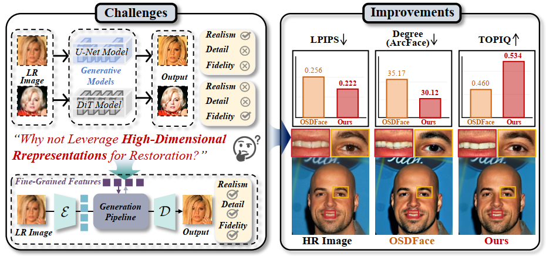
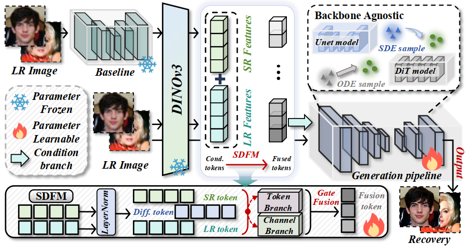

<h1 align="center">HDRFace: Rethinking Face Restoration with High-Dimensional Representation</h1>
<div align="center">
<hr>

Zirui Wang<sup>1,2*</sup>&nbsp; Xianhui Lin<sup>2</sup>&nbsp; Yi Dong<sup>2</sup>&nbsp; Bo Wei<sup>2</sup>&nbsp;  Gangjian Zhang<sup>2</sup>&nbsp; Siteng Ma<sup>2</sup>&nbsp; Zebiao Zheng<sup>2</sup>&nbsp; Xing Liu<sup>2</sup>&nbsp; Hong Gu<sup>2</sup>&nbsp; Minjing Dong<sup>1,†</sup>&nbsp;

<sup>1</sup> City University of Hong Kong &nbsp;&nbsp;<sup>2</sup> vivo BlueImage Lab&nbsp;&nbsp; 

<sup>*</sup> Work done when interning at vivo. <sup>†</sup> Corresponding authors.  


<h4>

<a href="">📄 arXiv Paper</a> &nbsp; 
<a href="">🌐 Project Page</a> &nbsp; 
<a href="">🤗 Hugging Face Models</a>
</h4>

</div>

<div align="center">

</div>
Figure 1. Motivation and improvements of HDRFace. (Left) Existing diffusion-based
methods rely solely on low-quality inputs, yielding outputs that lack fine-grained detail and faithful identity preservation. We address this by injecting high-dimensional visual representations into the generative pipeline. (Right) Our method consistently outperforms OSDFace in perceptual quality (LPIPS), identity consistency (ArcFace degree), and image quality (TOPIQ).

<!-- <h2> <p align="center">📦 HDRFace 📦</p> </h2>
<div align="center">

</div> -->

## ✨ Highlights

🎯 **High-Dimensional Priors** We propose a high-dimensional representation conditioned face restoration framework that injects DINOv3 semantic features into the conditional branch to provide priors beyond low-quality inputs and ease the ill-posedness caused by missing information.


🚀 **Adaptive Multi-Source Fusion** We design an architecture-independent module SDFM that adaptively fuses low-quality inputs with high-dimensional features, balancing structural consistency and detail fidelity without changing the generative backbone.

⭐️ **Backbone-Agnostic Generalization** Extensive experiments on SD V2.1-base and Qwen-Image demonstrate strong generalization and architecture independence with consistent restoration quality gains.

## 🛠️ 1. Environment Setup

The code is developed using **Python 3.10** and **PyTorch**.

```bash
# Create and activate environment
conda create -n HDRFace python=3.10
conda activate HDRFace

# Install dependencies
pip install -r requirements.txt
```

## 📦 2. Pretrained Weights

Please download the following weights and place them in the `./preset/models` directory.

| Component | Source / Link | Config Parameter |
| :--- | :--- | :--- |
| **SD V2.1-base** | [sd2-community/stable-diffusion-2-1](https://huggingface.co/sd2-community/stable-diffusion-2-1) | `model_id ` |
| **SD XL-base** | [stabilityai/stable-diffusion-xl-base-1.0](https://huggingface.co/stabilityai/stable-diffusion-xl-base-1.0) | `sdxl_path` |
| **DINOv3** | [facebookresearch/dinov3](https://github.com/facebookresearch/dinov3) | `dino_path` |
| **Qwen-Image** | [Qwen/Qwen-Image](https://huggingface.co/Qwen/Qwen-Image) | `qwen_path` |
| **Others** | [Google Drive]() | `Arcface/Landmarks` |

## 📂 3. Dataset Preparation

### 📊 Training Datasets
  1. **Getting GT Datasets**:

   - We use the FFHQ dataset as our training dataset. Download **FFHQ** ([Link](https://github.com/nvlabs/ffhq-dataset)).

  2. **Getting SR Datasets**: 
   - To speed up training, we restore the images required for training in advance. You can download them here ([Link]()).
   - After downloading the dataset, set `sr_root`  in the training script to the dataset path. 
  
### 🦅 Test Datasets
-  We evaluate our method on three datasets: CelebA-Test, LFW-Test, and CelebChild. The download links can be found in  Google Drive ([Link]()) or VQFR ([Link](https://github.com/TencentARC/VQFR)).
## 🚀 4. Usage

### 🎨 Quick Start (Demo)
You can download our restored image for testing here ([Link]()).
Download our pretrained models ([Link]()) and place them in `./pretrained` and `./pretrained_qwen`.
```bash
# Test sd
bash ./test_scripts/test_sd.sh
# Test qwen
bash ./test_scripts/test_qwen.sh
```
### 🧪 Evaluation
```bash
bash ./eval/eval.sh
```

## 🙏 Acknowledgements

Our codes are based on OSDFace ([Link](https://github.com/jkwang28/OSDFace)), ODTSR ([Link](https://github.com/RedMediaTech/ODTSR)), thanks for their contribution.


## 📜 Citation

If you find our work or code useful for your research, please cite:

```latex

```

